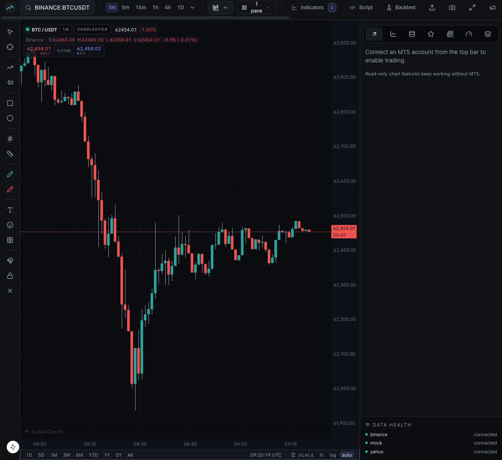
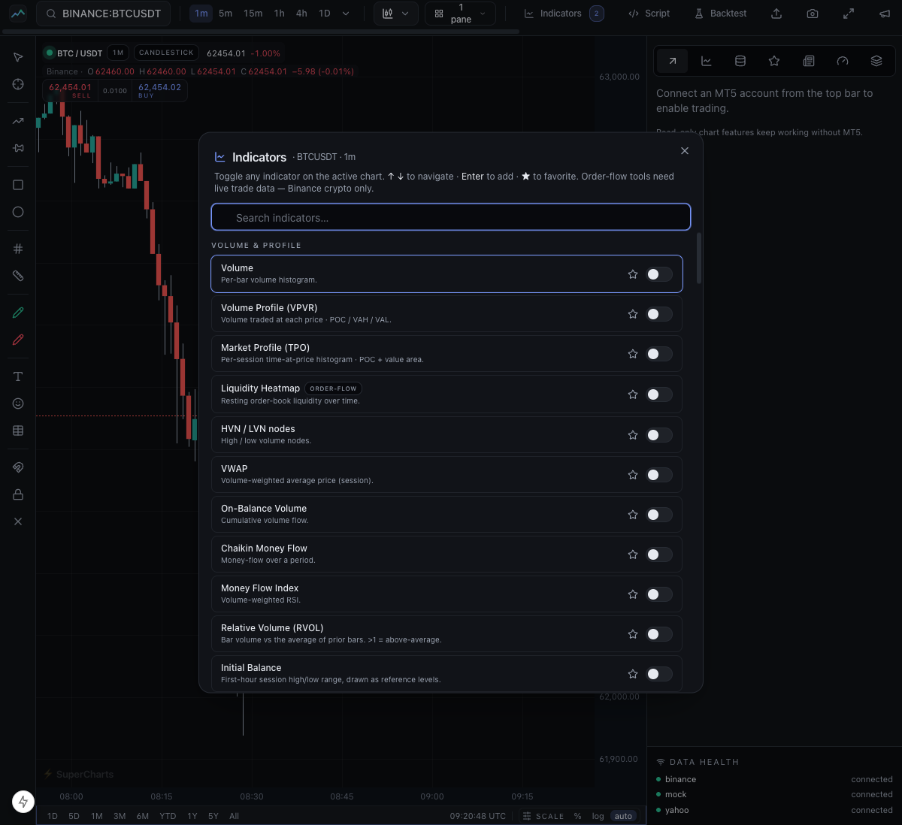
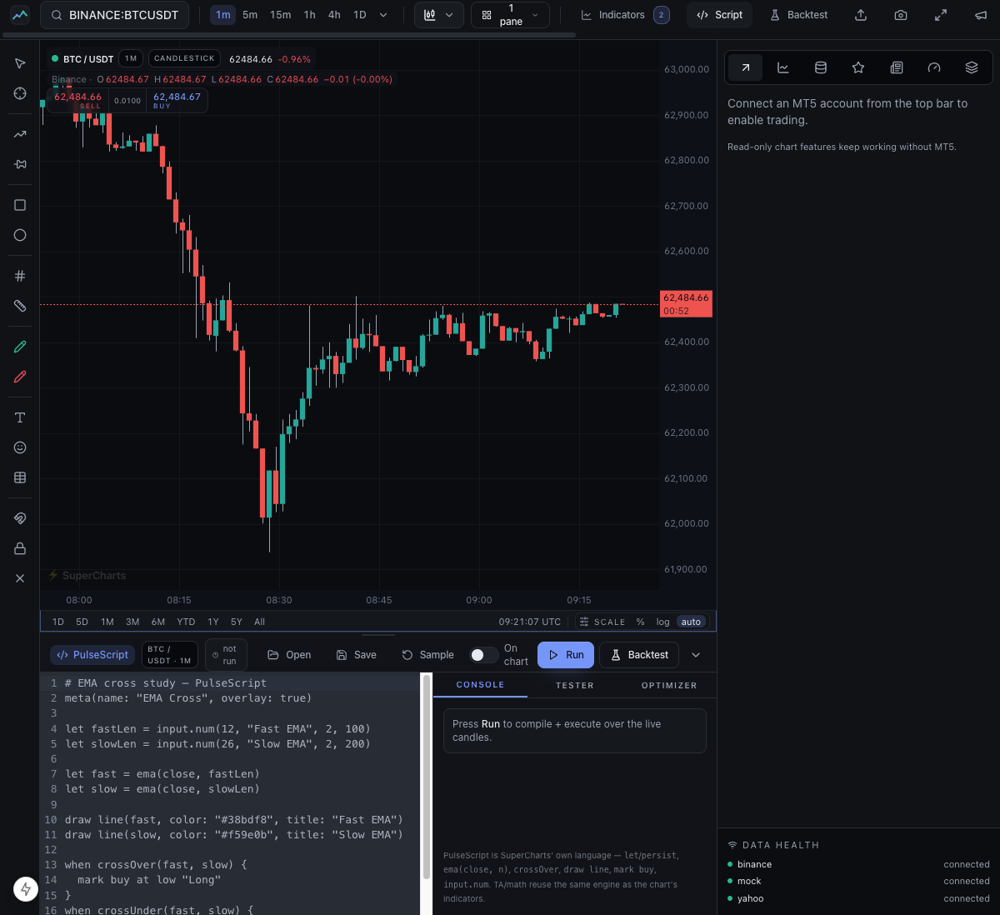
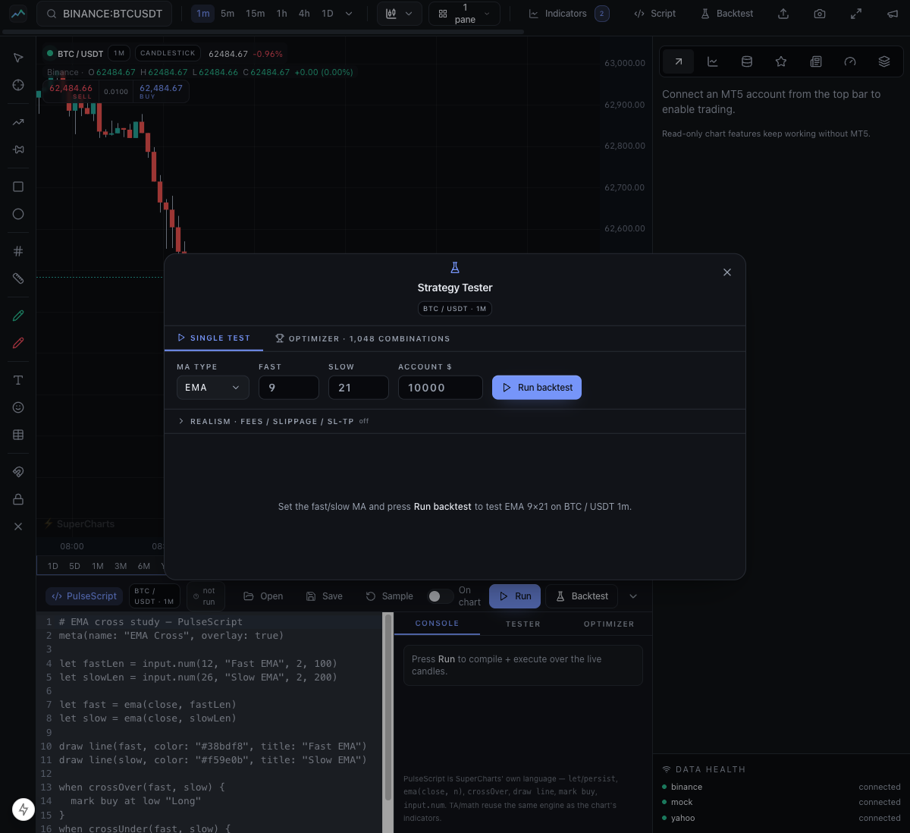
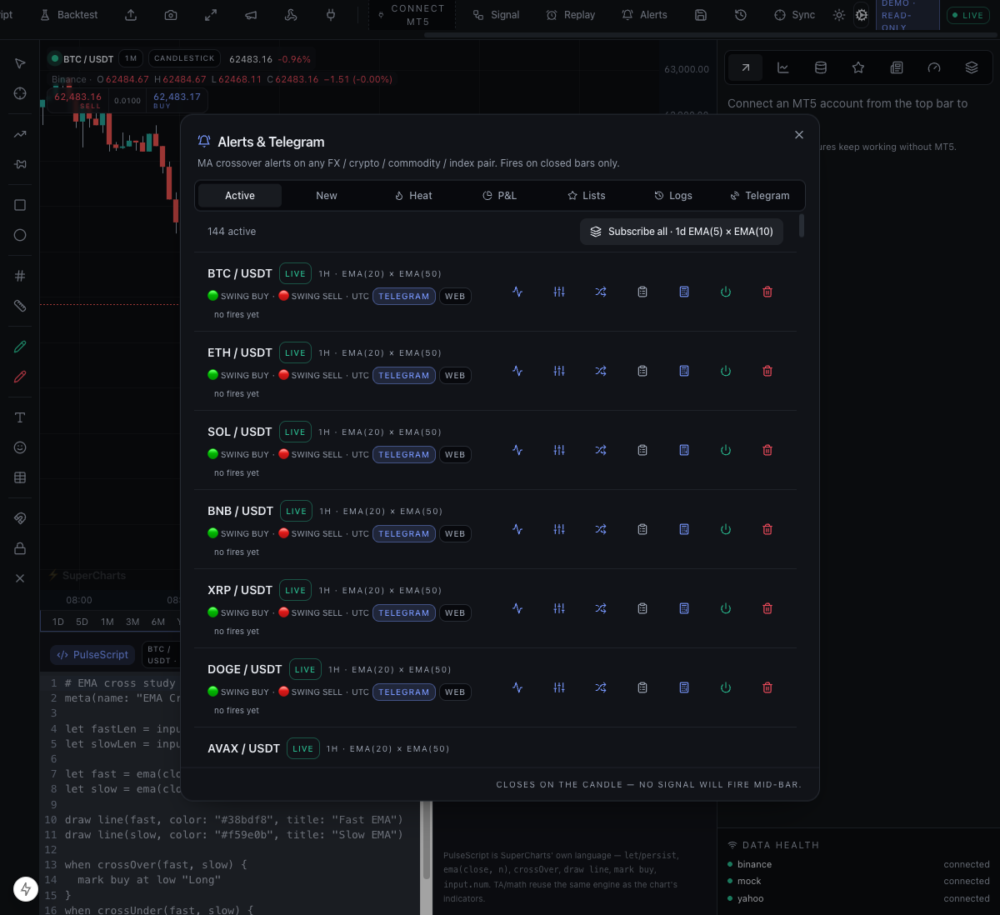
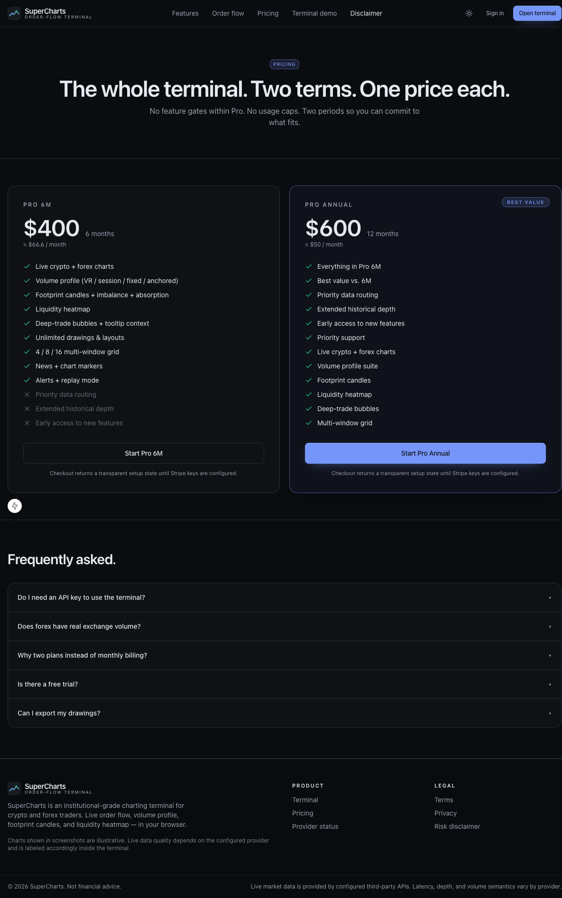

# SuperCharts

Institutional-grade browser charting terminal for crypto, forex, and multi-asset market analysis.

SuperCharts is built for traders who want the professional workflow of a premium charting terminal without paying for multiple subscriptions just to get the basics: multi-pane charts, order-flow views, footprint context, custom indicators, scripting, alerts, backtesting, and MT5 automation in one local-first workspace.

> SuperCharts is an original product. It is inspired by professional charting workflows, but it does not copy another vendor's branding, proprietary APIs, protected visual assets, or private implementation details.



## Why It Exists

TradingView is excellent, but serious traders quickly run into subscription pressure: more indicators, more alerts, more charts per layout, deeper tooling, and automation usually cost more or require stitching together separate apps.

SuperCharts gives you a full-stack alternative you can run, inspect, extend, and customize:

- Multi-window charting layouts without paying for pane limits.
- Advanced indicator coverage, including SMC, order-flow, liquidity, trend score, and custom PulseScript studies.
- Local strategy testing and parameter optimization instead of exporting ideas to another tool.
- Telegram/web alerts and MT5 bridge workflows under your control.
- Honest provider handling: crypto order flow from Binance, forex via broker/provider integrations, and no fabricated depth or volume where the market does not provide it.

## Highlights

- **Trading terminal UI**: TradingView-style top bar, interval favorites, chart-type controls, right rail, left tool rail, status line, range presets, log/percent/auto scale modes, and multi-pane layouts.
- **Live chart engine**: Canvas 2D layered renderer with candles, bars, line, area, Heikin Ashi, Renko, Kagi, Point & Figure, and other chart modes.
- **Order-flow toolkit**: liquidity heatmap, footprint candles, volume profile, market profile/TPO, time & sales, DOM ladder, open interest, whale/block highlights, and deep-trade bubbles.
- **Indicator system**: registry-driven classic indicators, overlay and sub-pane rendering, favorites, recently used, settings modal, legend/status line, Data Window, duplicate/reorder controls, and indicator-based alerts.
- **PulseScript**: original Pine-like scripting language with inputs, plots, markers, levels, background/candle painting, multi-timeframe `onTf`, sandboxing, persistence, and in-app editor.
- **Strategy research**: MA-cross backtester, strategy tester for script marks, optimizer, walk-forward testing, robustness flags, paper-trading, P&L attribution, and portfolio heat.
- **Automation bridge**: MT5 TCP bridge, order intents, account status, bulk automation hooks, Telegram delivery, Telegram broadcast channels, and inbound webhooks.
- **Data integrations**: Binance public streams, read-only Zerodha Kite Indian-market catalog/history/live quotes, OANDA onboarding, Yahoo FX/metals/index fallback, GDELT news, Forex Factory calendar mirror, custom CSV OHLC imports, and optional paid-provider keys.

## Screenshots

| Terminal | Indicator Dialog | PulseScript |
| --- | --- | --- |
|  |  |  |

| Strategy Tester | Alerts | Pricing |
| --- | --- | --- |
|  |  |  |

## What You Get Without Paying For TradingView

- **Chart layouts**: run dense 1/4/8/9/16-pane workflows locally.
- **Indicator depth**: ship your own studies, duplicate instances, reorder them, inspect every plot value, and script custom logic.
- **Alerts and automation**: connect Telegram, web alerts, inbound webhooks, and MT5 automation from your own server.
- **Research tooling**: backtest and optimize strategy parameters on real candles with transparent assumptions.
- **Data ownership**: keep layouts, scripts, custom datasets, and alert state in your own local SQLite-backed stack.
- **Extensibility**: every package is TypeScript and organized as a pnpm monorepo, so you can change the terminal rather than waiting for a closed platform to add what you need.

## Architecture

```text
supercharts/
├── apps/
│   ├── web/          Next.js 15 App Router terminal and marketing site
│   ├── api/          Fastify REST/WebSocket API, SQLite persistence, alert engine
│   ├── ingestion/    Provider streams, candles, footprint, heatmap, deep trades
│   ├── mt5-ea/       MetaTrader bridge assets
│   └── tv-recorder/  Local capture tooling
├── packages/
│   ├── chart-core/   Canvas chart engine and layers
│   ├── indicators/   Pure indicator implementations and registry
│   ├── market-data/  Provider adapters
│   ├── script-lang/  PulseScript lexer/parser/interpreter/stdlib
│   └── types/        Shared domain types
├── docs/             Architecture, language docs, setup guides, changelog
├── tests/            Vitest coverage for pure modules and API utilities
└── infra/            Optional local infrastructure
```

Read the deeper system map in [docs/architecture.md](docs/architecture.md).

## Quick Start

Requirements:

- Node.js 20+ (Node 26 recommended for the current API runtime)
- pnpm 9+
- Optional: Docker for local infra experiments

```bash
pnpm install
cp .env.example .env
cp .env.example apps/web/.env.local

pnpm -F @supercharts/api dev
pnpm -F @supercharts/web dev
```

Open [http://localhost:3000](http://localhost:3000), then launch the terminal.

The default crypto path works with Binance public data and does not require an API key. Optional providers such as OANDA, CryptoPanic, Finnhub, Twelve Data, Polygon, and Stripe require your own keys.

### Indian-market data via Zerodha Kite

SuperCharts can search every active instrument from Kite's daily NSE, BSE, NFO, MCX, CDS, and index catalog, then load a real chart for the selected `KITE:<exchange>:<symbol>` instrument. Configure `KITE_API_KEY` and a fresh `KITE_ACCESS_TOKEN` in your ignored local `.env`. Obtain the access token through Kite's official interactive login flow; SuperCharts does not collect or automate broker usernames, passwords, TOTP values, API secrets, orders, GTTs, portfolio calls, or any other trading operation.

Kite history is capped to one year per request. The terminal fetches only the selected symbol/interval, and live updates are demand-driven for open charts. Supported Kite resolutions are 1m, 3m, 5m, 15m, 30m, 1h, and 1D. Expired derivatives may not be discoverable because they are absent from Kite's active instrument dump.

## Environment

Use [.env.example](.env.example) as the canonical reference. The important defaults:

- `NEXT_PUBLIC_API_URL=http://localhost:4000`
- `NEXT_PUBLIC_WS_URL=ws://localhost:4000/ws`
- `DATABASE_URL=file:./data/supercharts.sqlite`
- `BINANCE_ENABLED=true`
- `GDELT_ENABLED=true`

Secrets such as `AUTH_SECRET`, `ENCRYPTION_KEY`, OANDA tokens, Telegram bot tokens, and Stripe keys must stay outside git.

## Scripts

```bash
pnpm dev                 # run all app dev servers
pnpm dev:web             # Next.js app on :3000
pnpm dev:api             # Fastify API on :4000
pnpm build               # build all packages/apps
pnpm typecheck           # TypeScript checks
pnpm test                # Vitest suite
pnpm lint                # ESLint
```

## Data Honesty

SuperCharts does not fabricate market data.

- Binance spot/futures features use Binance public streams and REST endpoints.
- Forex order books and centralized volume are not invented when a provider does not supply them.
- Optional providers report `not_configured` instead of silently faking responses.
- Kite live subscriptions are limited by provider capacity; symbols above that capacity remain searchable and historical-only rather than showing fabricated live data.
- Backtests and optimizer results should be treated as research outputs, not financial advice.

## Security Notes

- The current local demo uses a simplified development auth model.
- Do not expose your local API publicly unless `DEMO_MODE=1` is enabled and you understand the read-only guard.
- The Kite provider has an explicit market-data-only endpoint allowlist. It does not expose a trade-placement or account-management path.
- Keep `.env`, `.env.local`, SQLite databases, and screenshots with private account details out of git.
- Review [SECURITY.md](SECURITY.md) before deploying or accepting outside contributions.

## Roadmap

The repo already includes terminal, alerts, indicator system, PulseScript, strategy testing, OANDA onboarding, webhooks, Telegram broadcast, CSV import, and MT5 bridge work.

Next major areas:

- Embedded iframe charts
- Multi-user workspaces
- Auth.js production auth
- Stripe live billing
- Mobile responsive polish
- PWA/offline snapshots
- WASM indicator acceleration

## License

Source-available proprietary software. See [LICENSE](LICENSE).
